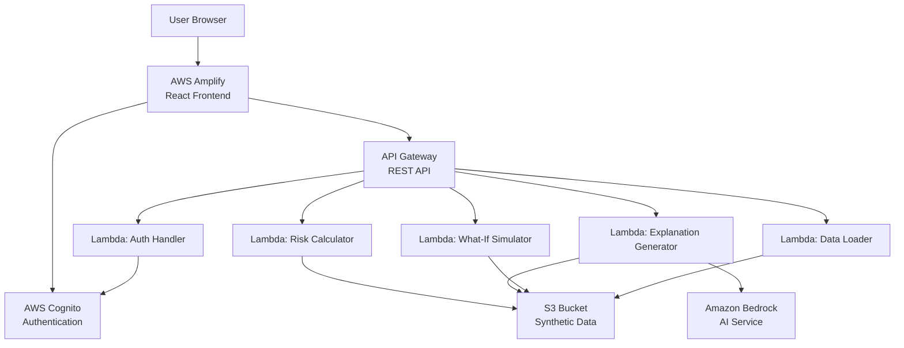
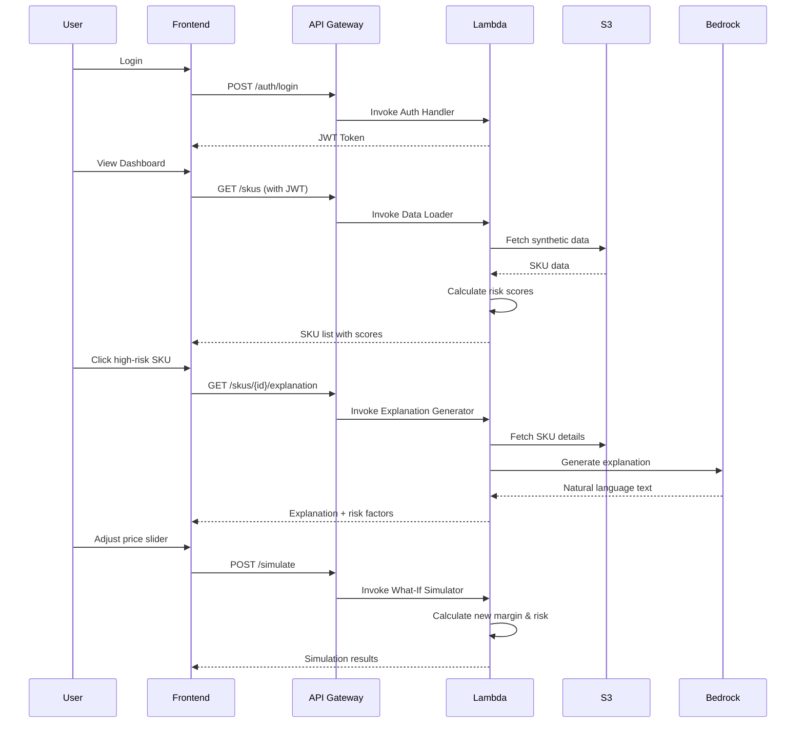

# Design Document: MarginGuard AI - Hackathon MVP

## Overview

MarginGuard AI is a serverless profit risk intelligence platform built on AWS that helps Amazon FBA sellers identify at-risk SKUs before profit erosion occurs. The hackathon MVP uses a simplified architecture with synthetic data, batch processing via Lambda functions, and Amazon Bedrock for AI-powered explanations.

The system consists of three main layers:
1. **Frontend Layer**: React SPA hosted on AWS Amplify with interactive visualizations
2. **API Layer**: API Gateway + Lambda functions for business logic
3. **Data Layer**: S3-based synthetic data store with pre-loaded sample SKUs

Key design principles:
- Serverless-first for rapid deployment and minimal infrastructure management
- Demo-optimized with pre-loaded data for instant results
- Visual-first UX with the Profit Health Radar as the centerpiece
- AI-augmented insights using Amazon Bedrock for natural language explanations

## Architecture

### High-Level Architecture



### Component Interaction Flow



## Components and Interfaces

### Frontend Components

#### 1. Authentication Module
- **Purpose**: Handle user login and session management
- **Technology**: React + AWS Amplify Auth library
- **Key Functions**:
  - `login(email, password)`: Authenticate user via Cognito
  - `logout()`: Clear session and redirect to login
  - `getAuthToken()`: Retrieve JWT for API calls
  - `isAuthenticated()`: Check if user has valid session

#### 2. Profit Health Radar Component
- **Purpose**: Visualize all SKUs on a 2D scatter plot with risk-based color coding
- **Technology**: React + D3.js or Recharts
- **Props**:
  - `skus`: Array of SKU objects with margin, velocity, and risk score
  - `onSkuClick`: Callback when user clicks a SKU
  - `filters`: Active filter criteria
- **Key Functions**:
  - `renderRadar()`: Draw scatter plot with color-coded points
  - `handleHover(sku)`: Show tooltip with SKU details
  - `handleClick(sku)`: Navigate to detail view
  - `applyFilters(criteria)`: Update visible SKUs

#### 3. SKU List Component
- **Purpose**: Display sortable, filterable table of all SKUs
- **Technology**: React + Material-UI or Ant Design table
- **Props**:
  - `skus`: Array of SKU objects
  - `onSort`: Callback for column sorting
  - `onFilter`: Callback for filter changes
- **Key Functions**:
  - `sortByColumn(column, direction)`: Sort table data
  - `filterByRisk(level)`: Filter by risk category
  - `searchByName(query)`: Filter by SKU name

#### 4. SKU Detail Component
- **Purpose**: Show detailed risk analysis and AI explanation for a single SKU
- **Technology**: React
- **Props**:
  - `sku`: SKU object with full details
  - `explanation`: AI-generated explanation text
  - `riskFactors`: Array of contributing factors
- **Key Functions**:
  - `fetchExplanation(skuId)`: Load AI explanation from API
  - `renderRiskFactors()`: Display top 3 risk factors with data
  - `openSimulator()`: Navigate to what-if simulation

#### 5. What-If Simulator Component
- **Purpose**: Allow users to simulate price changes and see impact
- **Technology**: React with controlled slider input
- **Props**:
  - `sku`: Current SKU data
  - `onSimulate`: Callback to run simulation
- **State**:
  - `adjustedPrice`: User-selected new price
  - `simulationResult`: Calculated impact on margin and risk
- **Key Functions**:
  - `handlePriceChange(newPrice)`: Update slider and trigger simulation
  - `calculateImpact()`: Call API to get new margin and risk score
  - `renderComparison()`: Show before/after metrics

### Backend Components

#### 1. Auth Handler Lambda
- **Purpose**: Validate credentials and manage authentication
- **Runtime**: Node.js 18.x or Python 3.11
- **Environment Variables**:
  - `COGNITO_USER_POOL_ID`
  - `COGNITO_CLIENT_ID`
- **Key Functions**:
  - `handler(event)`: Main Lambda entry point
  - `validateCredentials(email, password)`: Check against Cognito
  - `generateToken(userId)`: Create JWT for authenticated session

#### 2. Data Loader Lambda
- **Purpose**: Fetch synthetic SKU data from S3 and return to frontend
- **Runtime**: Python 3.11
- **Environment Variables**:
  - `S3_BUCKET_NAME`
  - `DATA_FILE_KEY`
- **Key Functions**:
  - `handler(event)`: Main Lambda entry point
  - `loadSyntheticData()`: Read JSON from S3
  - `parseSkuData(rawData)`: Convert to structured format
  - `applyFilters(skus, filters)`: Filter based on query parameters

#### 3. Risk Calculator Lambda
- **Purpose**: Calculate margin risk scores for SKUs
- **Runtime**: Python 3.11
- **Key Functions**:
  - `handler(event)`: Main Lambda entry point
  - `calculateRiskScore(sku)`: Compute 0-100 risk score
  - `analyzeMarginTrend(history)`: Detect declining margins
  - `evaluateAdSpendEfficiency(sku)`: Calculate ACOS impact
  - `assessFeeImpact(sku)`: Evaluate fee changes
  - `assessReturnRate(sku)`: Evaluate return impact
  - `weightFactors(factors)`: Combine factors into final score

**Risk Score Algorithm**:
```
Risk Score = (0.4 × Margin_Trend_Score) + 
             (0.3 × Ad_Efficiency_Score) + 
             (0.2 × Fee_Impact_Score) + 
             (0.1 × Return_Rate_Score)

Where each component score is 0-100:
- Margin_Trend_Score: 100 if declining >20% over 30 days, 0 if improving
- Ad_Efficiency_Score: 100 if ACOS >50%, 0 if ACOS <15%
- Fee_Impact_Score: 100 if fees increased >15%, 0 if stable
- Return_Rate_Score: 100 if returns >10%, 0 if <2%
```

#### 4. Explanation Generator Lambda
- **Purpose**: Generate natural language explanations using Amazon Bedrock
- **Runtime**: Python 3.11
- **Environment Variables**:
  - `BEDROCK_MODEL_ID` (e.g., "anthropic.claude-v2")
  - `S3_BUCKET_NAME`
- **Key Functions**:
  - `handler(event)`: Main Lambda entry point
  - `fetchSkuDetails(skuId)`: Load SKU data from S3
  - `identifyTopRiskFactors(sku)`: Determine top 3 contributors
  - `generatePrompt(sku, factors)`: Create Bedrock prompt
  - `callBedrock(prompt)`: Invoke Bedrock API
  - `parseResponse(response)`: Extract explanation text
  - `cacheExplanation(skuId, text)`: Store in memory for reuse

**Bedrock Prompt Template**:
```
You are an AI assistant helping Amazon FBA sellers understand profit risks.

SKU: {sku_name}
Current Margin: {margin}%
Risk Score: {risk_score}/100

Top Risk Factors:
1. {factor_1}: {data_point_1}
2. {factor_2}: {data_point_2}
3. {factor_3}: {data_point_3}

Generate a clear, concise explanation (2-3 sentences) of why this SKU is at risk. 
Focus on actionable insights. Use specific numbers from the data points.
```

#### 5. What-If Simulator Lambda
- **Purpose**: Calculate impact of price changes on margin and risk
- **Runtime**: Python 3.11
- **Key Functions**:
  - `handler(event)`: Main Lambda entry point
  - `parseSimulationRequest(event)`: Extract SKU ID and new price
  - `fetchCurrentData(skuId)`: Load current SKU metrics
  - `estimateDemandChange(priceChange)`: Apply price elasticity
  - `calculateNewMargin(newPrice, newVolume)`: Compute projected margin
  - `recalculateRiskScore(newMetrics)`: Get new risk score
  - `formatResponse(before, after)`: Return comparison data

**Price Elasticity Model** (Simplified):
```
For price increase of X%:
  Estimated volume decrease = X × 0.8 (assuming elasticity of -0.8)
  
For price decrease of X%:
  Estimated volume increase = X × 0.8

New Margin = ((New Price - COGS - Fees) / New Price) × 100
New Revenue = New Price × New Volume
```

### API Endpoints

#### Authentication
- `POST /auth/login`
  - Request: `{ "email": string, "password": string }`
  - Response: `{ "token": string, "userId": string, "expiresIn": number }`

#### SKU Data
- `GET /skus`
  - Query Params: `?riskLevel=high&search=keyword`
  - Response: `{ "skus": Array<SKU>, "count": number }`

- `GET /skus/{skuId}`
  - Response: `{ "sku": SKU, "history": Array<DataPoint> }`

#### Risk Analysis
- `GET /skus/{skuId}/explanation`
  - Response: `{ "explanation": string, "riskFactors": Array<Factor>, "score": number }`

#### Simulation
- `POST /simulate`
  - Request: `{ "skuId": string, "newPrice": number }`
  - Response: `{ "before": Metrics, "after": Metrics, "impact": Impact }`

## Data Models

### SKU Model
```typescript
interface SKU {
  id: string;                    // Unique identifier
  name: string;                  // Product name
  asin: string;                  // Amazon Standard Identification Number
  currentPrice: number;          // Current selling price
  cogs: number;                  // Cost of goods sold
  fbaFees: number;              // Fulfillment fees
  referralFees: number;         // Amazon referral fees
  adSpend30d: number;           // Ad spend last 30 days
  revenue30d: number;           // Revenue last 30 days
  unitsSold30d: number;         // Units sold last 30 days
  returns30d: number;           // Return count last 30 days
  currentMargin: number;        // Current profit margin %
  marginTrend: 'up' | 'down' | 'stable';
  riskScore: number;            // 0-100 risk score
  riskLevel: 'low' | 'medium' | 'high';
  salesVelocity: number;        // Units per day
  acos: number;                 // Advertising Cost of Sale %
  lastUpdated: string;          // ISO timestamp
}
```

### Risk Factor Model
```typescript
interface RiskFactor {
  name: string;                 // Factor name (e.g., "Declining Margin")
  impact: number;               // Contribution to risk score (0-100)
  dataPoint: string;            // Specific metric (e.g., "Margin down 15% in 30 days")
  severity: 'low' | 'medium' | 'high';
}
```

### Simulation Result Model
```typescript
interface SimulationResult {
  before: {
    price: number;
    margin: number;
    riskScore: number;
    projectedRevenue30d: number;
  };
  after: {
    price: number;
    margin: number;
    riskScore: number;
    projectedRevenue30d: number;
    estimatedVolumeChange: number;  // Percentage change
  };
  recommendation: string;       // AI-generated recommendation
}
```

### Synthetic Data Structure (S3)
```json
{
  "skus": [
    {
      "id": "SKU001",
      "name": "Premium Yoga Mat",
      "asin": "B08XYZ1234",
      "currentPrice": 39.99,
      "cogs": 12.50,
      "fbaFees": 5.20,
      "referralFees": 6.00,
      "adSpend30d": 450.00,
      "revenue30d": 2800.00,
      "unitsSold30d": 70,
      "returns30d": 3,
      "history": [
        {
          "date": "2024-01-01",
          "margin": 42.5,
          "adSpend": 120,
          "revenue": 920
        }
      ]
    }
  ],
  "metadata": {
    "generatedAt": "2024-01-15T00:00:00Z",
    "skuCount": 50,
    "version": "1.0"
  }
}
```


## Correctness Properties

A property is a characteristic or behavior that should hold true across all valid executions of a system—essentially, a formal statement about what the system should do. Properties serve as the bridge between human-readable specifications and machine-verifiable correctness guarantees.

### Property 1: Risk Score Bounds
*For any* SKU with valid data, the calculated risk score should be between 0 and 100 (inclusive).
**Validates: Requirements 3.1**

### Property 2: Risk Score Monotonicity with Risk Factors
*For any* two SKUs that differ only in one risk factor (margin trend, ACOS, fees, or returns), the SKU with the worse factor value should have a higher or equal risk score.
**Validates: Requirements 3.2, 3.3, 3.4, 3.5**

### Property 3: Risk Score Recalculation
*For any* SKU, if its underlying data changes (margin, ad spend, fees, or returns), recalculating the risk score should produce a different value unless the change doesn't affect any risk factors.
**Validates: Requirements 3.8**

### Property 4: Authentication Success for Valid Credentials
*For any* user with valid credentials stored in Cognito, authentication should succeed and return a valid JWT token.
**Validates: Requirements 1.2**

### Property 5: Authentication Failure for Invalid Credentials
*For any* invalid credential combination (wrong email, wrong password, or non-existent user), authentication should fail and return an error.
**Validates: Requirements 1.3**

### Property 6: Session Persistence
*For any* authenticated user, the JWT token should remain valid for 24 hours from issuance.
**Validates: Requirements 1.4**

### Property 7: User Registration
*For any* valid email and password combination meeting Cognito requirements, user registration should succeed and create a new user account.
**Validates: Requirements 1.5**

### Property 8: Data Completeness
*For any* SKU in the synthetic data store, all required fields (id, name, asin, currentPrice, cogs, fbaFees, referralFees, adSpend30d, revenue30d, unitsSold30d, returns30d, currentMargin, marginTrend, salesVelocity) should be present and non-null.
**Validates: Requirements 2.2, 7.2**

### Property 9: JSON Serialization Round Trip
*For any* valid SKU object, serializing to JSON and then deserializing should produce an equivalent object with all fields preserved.
**Validates: Requirements 2.5**

### Property 10: Explanation Structure Completeness
*For any* SKU explanation generated by Bedrock, the response should contain exactly 3 risk factors, each with a name, impact score, data point, and severity level.
**Validates: Requirements 4.3, 4.4**

### Property 11: Risk Factor Prioritization
*For any* SKU with multiple risk factors, the factors in the explanation should be ordered by impact score in descending order (highest impact first).
**Validates: Requirements 4.5**

### Property 12: Explanation Caching
*For any* SKU, requesting an explanation twice within the same session should result in only one call to Amazon Bedrock, with the second request served from cache.
**Validates: Requirements 4.7**

### Property 13: Radar Visualization Completeness
*For any* set of SKUs loaded in the dashboard, the Profit Health Radar should render a visual element for each SKU.
**Validates: Requirements 5.1**

### Property 14: Risk Level Color Mapping
*For any* SKU, the color assigned in the Profit Health Radar should be green if risk score is 0-39, yellow if 40-69, and red if 70-100.
**Validates: Requirements 5.2**

### Property 15: Radar Position Calculation
*For any* SKU, its position on the Profit Health Radar should be calculated from its profit margin (x-axis) and sales velocity (y-axis) using consistent scaling.
**Validates: Requirements 5.3**

### Property 16: Tooltip Content Completeness
*For any* SKU on the Profit Health Radar, hovering should display a tooltip containing the SKU name, risk score, and current margin.
**Validates: Requirements 5.4**

### Property 17: Price Elasticity Simulation
*For any* SKU and any price change within the allowed range (-50% to +100%), the What-If Simulator should calculate the new margin using the price elasticity formula and return a new risk score.
**Validates: Requirements 6.3, 6.4, 6.5, 6.6**

### Property 18: Simulation Input Bounds
*For any* simulation request, price adjustments should be accepted if they are between -50% and +100% of the current price, and rejected otherwise.
**Validates: Requirements 6.7**

### Property 19: Simulation Output Completeness
*For any* successful simulation, the response should contain before and after values for price, margin, risk score, and projected revenue.
**Validates: Requirements 6.8**

### Property 20: Table Sorting
*For any* column in the SKU table, clicking the column header should sort all rows by that column's values in ascending or descending order.
**Validates: Requirements 7.3**

### Property 21: Risk Level Filtering
*For any* risk level filter (Low: 0-39, Medium: 40-69, High: 70-100), applying the filter should show only SKUs whose risk scores fall within that range.
**Validates: Requirements 7.4**

### Property 22: SKU Search
*For any* search query, the filtered results should include only SKUs whose name or ID contains the query string (case-insensitive).
**Validates: Requirements 7.6**

### Property 23: Risk Category Counts
*For any* set of SKUs, the displayed count for each risk category (low, medium, high) should equal the actual number of SKUs with risk scores in that range.
**Validates: Requirements 7.7**

### Property 24: API Endpoint Routing
*For any* valid API request to a defined endpoint, the API Gateway should route it to the correct Lambda function based on the path and HTTP method.
**Validates: Requirements 8.3**

## Error Handling

### Authentication Errors
- **Invalid Credentials**: Return 401 Unauthorized with message "Invalid email or password"
- **Expired Token**: Return 401 Unauthorized with message "Session expired, please log in again"
- **Missing Token**: Return 401 Unauthorized with message "Authentication required"

### Data Errors
- **SKU Not Found**: Return 404 Not Found with message "SKU {id} not found"
- **Invalid SKU Data**: Return 400 Bad Request with message "SKU data is incomplete or invalid"
- **S3 Access Error**: Return 500 Internal Server Error with message "Unable to load data, please try again"

### Simulation Errors
- **Invalid Price Range**: Return 400 Bad Request with message "Price adjustment must be between -50% and +100%"
- **Missing Parameters**: Return 400 Bad Request with message "Required parameter {param} is missing"

### Bedrock Errors
- **API Timeout**: Return 504 Gateway Timeout with message "AI explanation generation timed out, please try again"
- **Rate Limit**: Return 429 Too Many Requests with message "Too many requests, please wait and try again"
- **Model Error**: Return 500 Internal Server Error with message "Unable to generate explanation, please try again"

### General Error Handling Strategy
1. All Lambda functions should catch exceptions and return structured error responses
2. Frontend should display user-friendly error messages and provide retry options
3. Errors should be logged to CloudWatch for debugging
4. Sensitive information (stack traces, internal IDs) should not be exposed to users
5. Transient errors (timeouts, rate limits) should trigger automatic retry with exponential backoff

## Testing Strategy

### Dual Testing Approach

The testing strategy employs both unit tests and property-based tests to ensure comprehensive coverage:

- **Unit Tests**: Verify specific examples, edge cases, and error conditions
- **Property Tests**: Verify universal properties across all inputs through randomization

Both approaches are complementary and necessary. Unit tests catch concrete bugs in specific scenarios, while property tests verify general correctness across a wide input space.

### Property-Based Testing Configuration

**Library Selection**:
- **Python**: Use `hypothesis` library for Lambda functions
- **TypeScript/JavaScript**: Use `fast-check` library for React components

**Test Configuration**:
- Each property test must run a minimum of 100 iterations
- Each test must include a comment tag referencing the design property
- Tag format: `# Feature: marginguard-ai-mvp, Property {number}: {property_text}`

**Example Property Test (Python)**:
```python
from hypothesis import given, strategies as st

# Feature: marginguard-ai-mvp, Property 1: Risk Score Bounds
@given(st.builds(SKU, 
    currentMargin=st.floats(min_value=-100, max_value=100),
    acos=st.floats(min_value=0, max_value=200),
    # ... other fields
))
def test_risk_score_bounds(sku):
    score = calculate_risk_score(sku)
    assert 0 <= score <= 100
```

**Example Property Test (TypeScript)**:
```typescript
import fc from 'fast-check';

// Feature: marginguard-ai-mvp, Property 14: Risk Level Color Mapping
test('risk level color mapping', () => {
  fc.assert(
    fc.property(
      fc.integer({ min: 0, max: 100 }),
      (riskScore) => {
        const color = getRiskColor(riskScore);
        if (riskScore <= 39) return color === 'green';
        if (riskScore <= 69) return color === 'yellow';
        return color === 'red';
      }
    ),
    { numRuns: 100 }
  );
});
```

### Unit Testing Strategy

**Focus Areas**:
1. **Edge Cases**: Test boundary conditions (score = 0, score = 100, empty data)
2. **Error Conditions**: Test invalid inputs, missing data, API failures
3. **Integration Points**: Test Lambda-S3 integration, Frontend-API integration
4. **Specific Examples**: Test known scenarios from synthetic data

**Unit Test Balance**:
- Avoid writing too many unit tests for scenarios covered by property tests
- Focus unit tests on concrete examples that demonstrate correct behavior
- Use unit tests for integration testing between components

**Example Unit Test (Python)**:
```python
def test_high_risk_sku_threshold():
    """Test that declining margin over 30 days results in high risk score"""
    sku = create_sku_with_declining_margin(decline_percent=25)
    score = calculate_risk_score(sku)
    assert score > 60, f"Expected score > 60 for declining margin, got {score}"
```

**Example Unit Test (TypeScript)**:
```typescript
test('login interface displays on app load', () => {
  render(<App />);
  expect(screen.getByLabelText('Email')).toBeInTheDocument();
  expect(screen.getByLabelText('Password')).toBeInTheDocument();
  expect(screen.getByRole('button', { name: 'Login' })).toBeInTheDocument();
});
```

### Test Coverage Goals

- **Backend Lambda Functions**: 80% code coverage minimum
- **Frontend Components**: 70% code coverage minimum
- **Critical Paths**: 100% coverage for risk calculation and simulation logic
- **Property Tests**: All 24 properties must have corresponding property-based tests

### Testing Tools

**Backend**:
- `pytest` for unit tests
- `hypothesis` for property-based tests
- `moto` for mocking AWS services (S3, Bedrock)
- `pytest-cov` for coverage reporting

**Frontend**:
- `Jest` for unit tests
- `React Testing Library` for component tests
- `fast-check` for property-based tests
- `MSW` (Mock Service Worker) for API mocking

### Continuous Integration

- All tests must pass before deployment
- Property tests run on every commit
- Coverage reports generated and tracked over time
- Failed property tests should output the failing example for debugging
